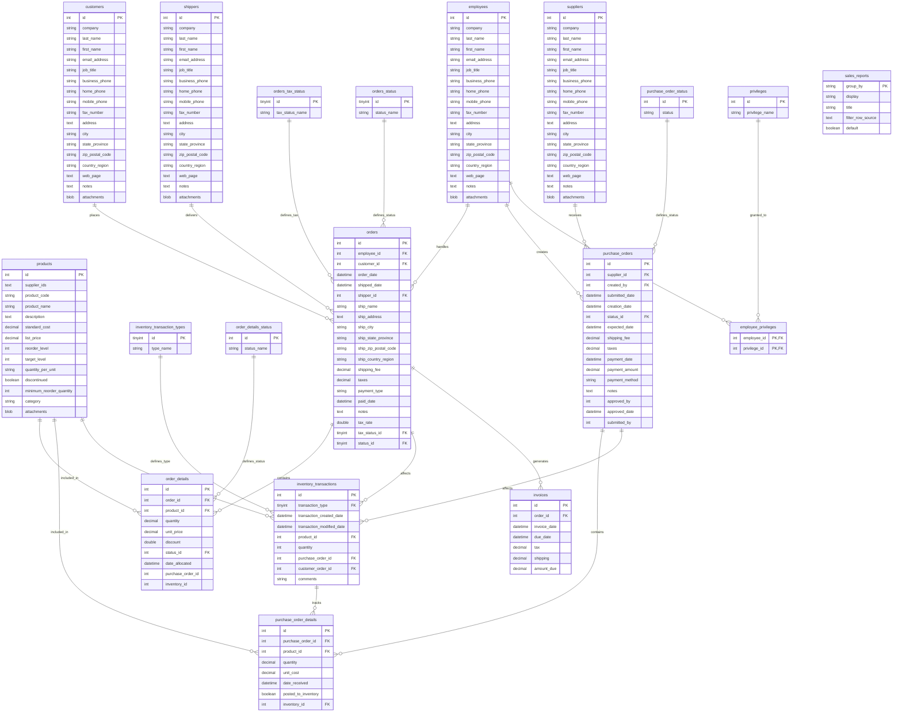

```mermaid
erDiagram
    %% Base Contact/Person Tables
    customers {
        int id PK
        string company
        string last_name
        string first_name
        string email_address
        string job_title
        string business_phone
        string home_phone
        string mobile_phone
        string fax_number
        text address
        string city
        string state_province
        string zip_postal_code
        string country_region
        text web_page
        text notes
        blob attachments
    }

    employees {
        int id PK
        string company
        string last_name
        string first_name
        string email_address
        string job_title
        string business_phone
        string home_phone
        string mobile_phone
        string fax_number
        text address
        string city
        string state_province
        string zip_postal_code
        string country_region
        text web_page
        text notes
        blob attachments
    }

    suppliers {
        int id PK
        string company
        string last_name
        string first_name
        string email_address
        string job_title
        string business_phone
        string home_phone
        string mobile_phone
        string fax_number
        text address
        string city
        string state_province
        string zip_postal_code
        string country_region
        text web_page
        text notes
        blob attachments
    }

    shippers {
        int id PK
        string company
        string last_name
        string first_name
        string email_address
        string job_title
        string business_phone
        string home_phone
        string mobile_phone
        string fax_number
        text address
        string city
        string state_province
        string zip_postal_code
        string country_region
        text web_page
        text notes
        blob attachments
    }

    products {
        int id PK
        text supplier_ids
        string product_code
        string product_name
        text description
        decimal standard_cost
        decimal list_price
        int reorder_level
        int target_level
        string quantity_per_unit
        boolean discontinued
        int minimum_reorder_quantity
        string category
        blob attachments
    }

    %% Lookup Tables
    privileges {
        int id PK
        string privilege_name
    }

    inventory_transaction_types {
        tinyint id PK
        string type_name
    }

    orders_tax_status {
        tinyint id PK
        string tax_status_name
    }

    orders_status {
        tinyint id PK
        string status_name
    }

    purchase_order_status {
        int id PK
        string status
    }

    order_details_status {
        int id PK
        string status_name
    }

    %% Transaction Tables
    orders {
        int id PK
        int employee_id FK
        int customer_id FK
        datetime order_date
        datetime shipped_date
        int shipper_id FK
        string ship_name
        text ship_address
        string ship_city
        string ship_state_province
        string ship_zip_postal_code
        string ship_country_region
        decimal shipping_fee
        decimal taxes
        string payment_type
        datetime paid_date
        text notes
        double tax_rate
        tinyint tax_status_id FK
        tinyint status_id FK
    }

    purchase_orders {
        int id PK
        int supplier_id FK
        int created_by FK
        datetime submitted_date
        datetime creation_date
        int status_id FK
        datetime expected_date
        decimal shipping_fee
        decimal taxes
        datetime payment_date
        decimal payment_amount
        string payment_method
        text notes
        int approved_by
        datetime approved_date
        int submitted_by
    }

    inventory_transactions {
        int id PK
        tinyint transaction_type FK
        datetime transaction_created_date
        datetime transaction_modified_date
        int product_id FK
        int quantity
        int purchase_order_id FK
        int customer_order_id FK
        string comments
    }

    invoices {
        int id PK
        int order_id FK
        datetime invoice_date
        datetime due_date
        decimal tax
        decimal shipping
        decimal amount_due
    }

    %% Detail Tables
    order_details {
        int id PK
        int order_id FK
        int product_id FK
        decimal quantity
        decimal unit_price
        double discount
        int status_id FK
        datetime date_allocated
        int purchase_order_id
        int inventory_id
    }

    purchase_order_details {
        int id PK
        int purchase_order_id FK
        int product_id FK
        decimal quantity
        decimal unit_cost
        datetime date_received
        boolean posted_to_inventory
        int inventory_id FK
    }

    employee_privileges {
        int employee_id PK,FK
        int privilege_id PK,FK
    }

    sales_reports {
        string group_by PK
        string display
        string title
        text filter_row_source
        boolean default
    }

    %% Relationships
    customers ||--o{ orders : places
    employees ||--o{ orders : handles
    shippers ||--o{ orders : delivers
    orders_tax_status ||--o{ orders : defines_tax
    orders_status ||--o{ orders : defines_status
    
    orders ||--o{ order_details : contains
    products ||--o{ order_details : included_in
    order_details_status ||--o{ order_details : defines_status
    
    suppliers ||--o{ purchase_orders : receives
    employees ||--o{ purchase_orders : creates
    purchase_order_status ||--o{ purchase_orders : defines_status
    
    purchase_orders ||--o{ purchase_order_details : contains
    products ||--o{ purchase_order_details : included_in
    inventory_transactions ||--o{ purchase_order_details : tracks
    
    employees ||--o{ employee_privileges : has
    privileges ||--o{ employee_privileges : granted_to
    
    products ||--o{ inventory_transactions : tracks
    orders ||--o{ inventory_transactions : affects
    purchase_orders ||--o{ inventory_transactions : affects
    inventory_transaction_types ||--o{ inventory_transactions : defines_type
    
    orders ||--o{ invoices : generates
```